## Alocação de Salas

Um sistema desenvolvido para facilitar a alocação eficiente de salas para um departamento. Este projeto visa otimizar o processo de atribuição de espaços físicos, proporcionando uma solução automatizada e fácil de usar.

## Funcionalidades

- **Inserir uma solicitação:** é possível fazer a inserção das solicitações
  
- **Inserir um espaço:** é possível fazer a inserção dos espaços que tem no departamento
  
- **Alocar Espaço:** Usa algoritmos de modo a facilitar a alocação de espaços sem que tenha nenhum conflito de horario
  
- **Salvar Relátorios:** O programa também permite que o usuário possa deixar as alocações salvas nos relátorios
  
- **Dados Salvos:** Após o fechamento do sistema, os itens ja alocados continuaram salvos em arquivos de modo que ao abrir ele consiga puxar todas as alterações feitas anteriomente
## Instruções de Instalação

1. **Clone o repositório:**
   
   ```bash
   git clone https://github.com/PatrickAraujoD/ALOCACAO-DE-SALAS
   
3. **Abra o Projeto no IntelliJ IDEA:**
   
   - Abra o IntelliJ IDEA.
   - Selecione "Open" no menu principal.
   - Localize a pasta clonada anteriomente
     
5. **Execute o Projeto:**
   
   - Selecione o **JDK 21**
   - Encontre a classe principal (normalmente aquela com o método main) no IntelliJ IDEA.
   - Clique com o botão direito na classe principal e selecione "Run".
     
## Uso

Após a execução do programa, você será apresentado a uma interface gráfica com as seguintes funcionalidades, representadas por seis botões:

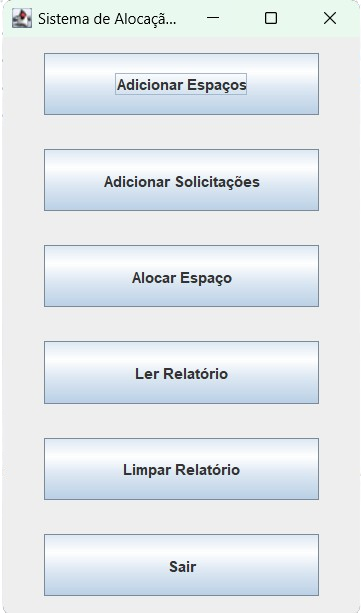

1. **Inserir Solicitação:**
   1. **Inserir Solicitação:**
   - Ao clicar neste botão, o usuário será solicitado a escolher o tipo de solicitação:
     
     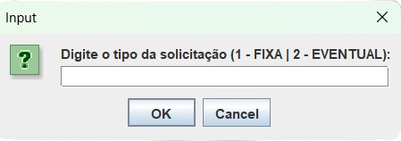

   - Digite `1` para solicitação eventual ou `2` para solicitação fixa.

   - Após a escolha, prossiga preenchendo os dados de solicitação. Alguns campos são específicos para solicitações fixas e eventuais.
      

3. **Inserir Espaço:**
   - Permite a inserção de informações sobre os espaços disponíveis no departamento.
     
     Campos depois de clicar no botão para adicionar um espaço:
     
     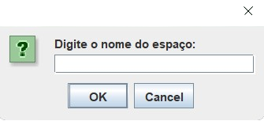&nbsp;&nbsp;&nbsp;&nbsp;
     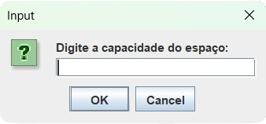
     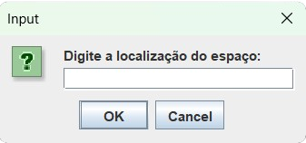
     
4. **Alocar Espaço:**
   - Utiliza algoritmos para facilitar a alocação de espaços, evitando conflitos de horário.
     
     Logo após aparecerá a tela com todas as solicitações, gravadas antes da execução e no mesmo tempo em que está sendo executado:
     
     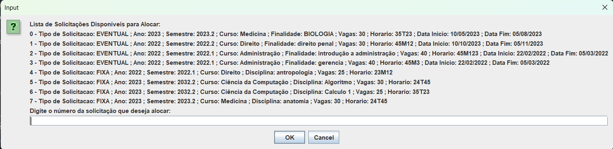

     Depois de escolhida a solicitação, aparecerão as telas com as salas disponíveis.

     - Para solicitações eventuais, apenas auditorios estarão disponíveis:
       
       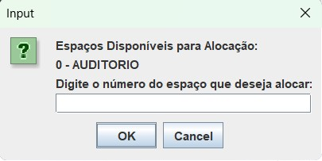

     - Para solicitações fixas, todas as salas sem conflitos de horário serão exibidas:
       
       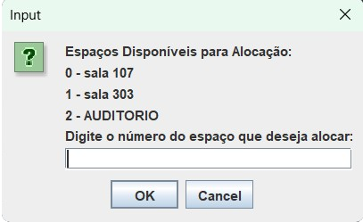


6. **Salvar Relatórios:**
   
   - Os relatórios do sistema são salvos automaticamente. O usuário poderá fazer uma pesquisa de duas formas: Por curso e por espaço físico.
     
     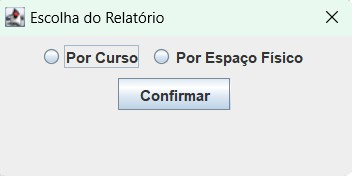

     - **Por Curso:**
       
       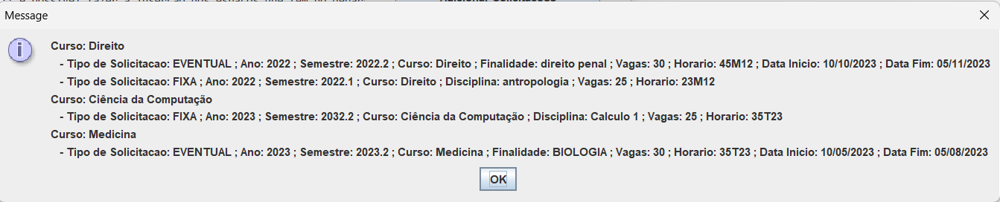

     - **Por Espaço Físico:**
       
       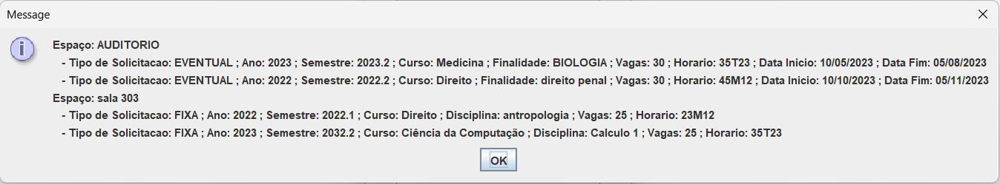

8. **Excluir Relatórios:**
   
   - O usuário também terão a opção de apagar os relatórios já existentes no sistema.
     
9. **Dados Salvos:**
   - Após o fechamento do programa, os dados previamente alocados permanecerão salvos, sendo recuperados na próxima execução.
   - 
## Licença

Este projeto é licenciado sob a [Licença MIT](LICENSE).

Isso significa que você tem total liberdade para copiar, modificar, distribuir e utilizar o código deste projeto para qualquer finalidade, mesmo comercialmente. Consulte o arquivo [LICENSE](LICENSE) para obter mais detalhes.

## Contato

Se tiver alguma dúvida, sugestão ou precisar de suporte, sinta-se à vontade para entrar em contato com os criadores do projeto:

- Patrick Camara Araujo
  - E-mail: [e-mail1@example.com](mailto:patrick.araujo@discente.ufma.com)
  - GitHub: [@PatrickAraujoD](https://github.com/PatrickAraujoD)

- Vitor Gabriel Rodrigues Sousa
  - E-mail: [e-mail2@example.com](mailto:vitor.grs@discente.ufma.com)
  - GitHub: [@vitorgrs](https://github.com/vitorgrs)

Não hesite em nos contatar! Estamos aqui para ajudar.
